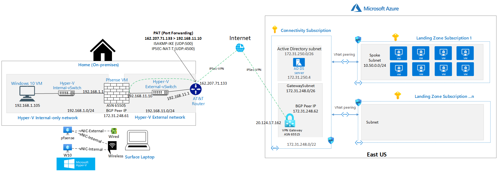
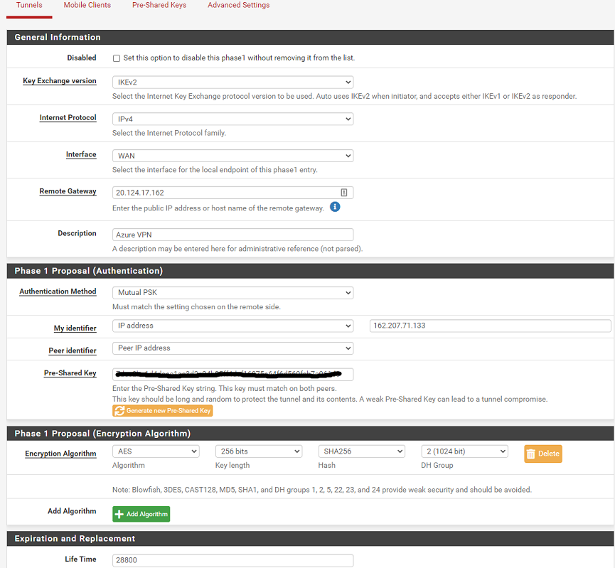
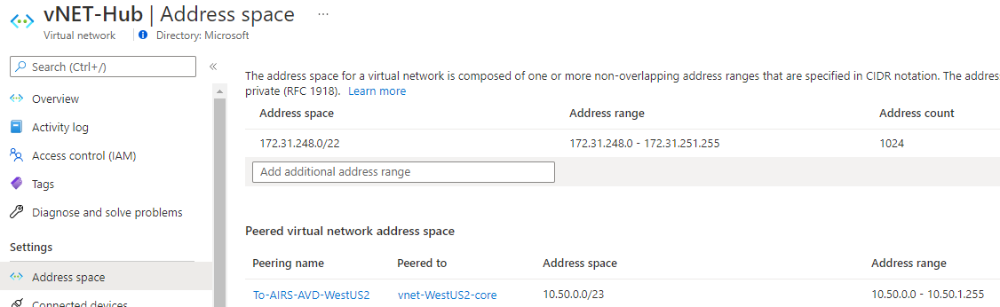
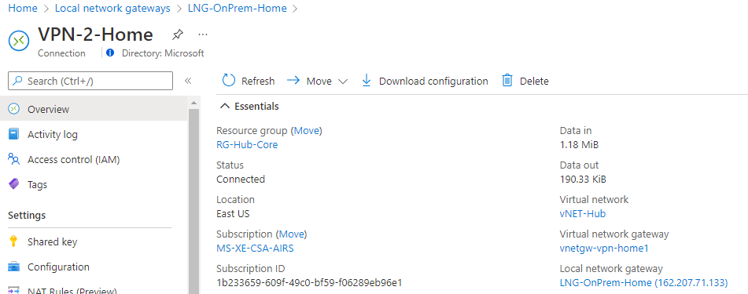
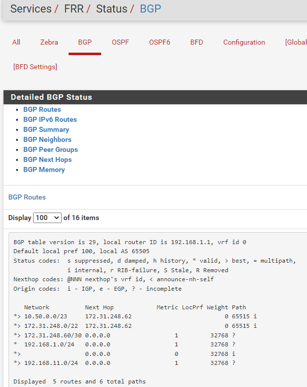
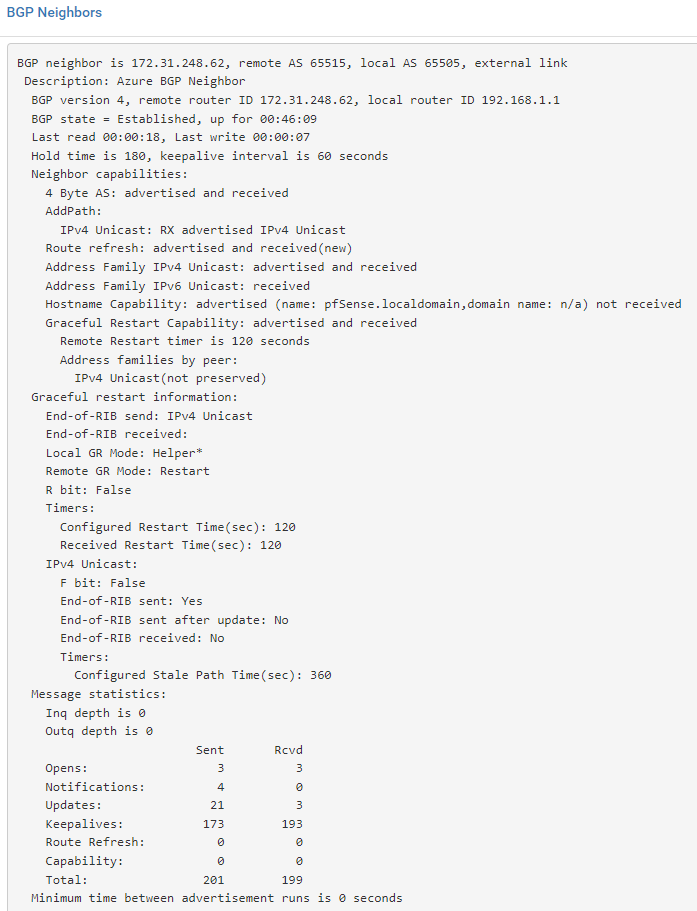

# Home Lab to emulate On-Premises (IPSec S2S) VPN to Azure

**Contents**

[Background](#Background)

[Components](#Components)

[Setup](#Setup)

[Functionality checks and validation](#Functionality-checks-and-validation)

[Acknowledgments](#Acknowledgments)

## Background

In my role as Cloud Solution Architect (CSA) at Microsoft I had the need to test scenarios and architectures of my own research and also validate customer architectures that involved a connection from On-Premises to Azure via [IPSec IKE Site to Site (S2S) VPN](https://docs.microsoft.com/azure/vpn-gateway/design#s2smulti). While you can also emulate this by creating a [VPN between VNets](https://docs.microsoft.com/azure/vpn-gateway/vpn-gateway-howto-vnet-vnet-resource-manager-portal), I wanted to really test this outside of the Azure fabric. I also wanted to avoid a major redo in my home network and perform the least amount of change and expense, so this lab worked perfectly for my needs.

I plan to update this article at a later time with a way for you to deploy as much as possible a similar environment in a more automated way but for now, this first round is meant to document my lab and also help you to build a lab environment similar to mine to give you the capability to demonstrate and validate VPN concepts.

It is also expected that you have some medium to advanced experience already with these network concepts. I will also work on elaborating more around the concepts in this article and adding additional explanation.
  
### Architecture

**Note:** There's a sub-diagram for reference on how the the Surface laptop is "wired"  

## Components

This is a summary of the components:

1. **Surface Laptop.** I initially started with Windows 10 Enterprise, but recently upgraded to Windows 11 Enterprise without any issues or changes.
    1. **Network adapters.** Both, wireless and wired network adapters in my laptop are used. I rely on a Surface Dock for the wired adapter because this laptop does not come with one. Also there's a dependency to stay docked for this lab to work.
    2. **Hyper-V.** Hyper-V role ia enabled.
    3. **Network adapters.** 2 virtual switches created, one External Switch (mapped to the wired adapter) and the Default Internal Switch (mapped wireless adapter)
2. **pfsense firewall Hyper-V VM.** Used to establish IPSec VPN with Azure
    1. **Network adapters.** Uses 2 network interfaces, connected to the Hyper-V Internal and External Switch respectively
    2. **Dynamic Routing Package** You'd need to install a package in order to use BGP dynamic routing for the VPN tunnel. You can also do static routing, if desired. In my lab I'm using OpenBGPD. Although I believe it is no longer supported with pfsense. I will work on switching to FRR which is a supported package and update this repo, but functionality and the end result should be the same.
3. **AT&T Gateway.** My ISP is AT&T and they provide a Gateway/Router that has built-in PAT/NAT features
4. **Azure Subscription**
    1. **Hub and Spoke network topology.** An operational Hub VNet with peering to a spoke VNet
    2. **VPN Gateway.** An Azure Virtual Network Gateway deployed in the Hub VNet. For [routed-based (dynamic routing)](https://docs.microsoft.com/azure/vpn-gateway/vpn-gateway-vpn-faq#what-is-a-route-based-dynamic-routing-gateway) with BGP the [minimum SKU supported is VpnGw1](https://docs.microsoft.com/azure/vpn-gateway/vpn-gateway-about-vpngateways#benchmark).

## Setup

### Surface Laptop

1. **Network Adapters in Windows.** These is how the 2 adapters are shown from Network Connections

2. **Hyper-V Virtual Switches.** These is how the 2 adapters are shown Hyper-V Virtual Switch Manager. The Default virtual switch is created automatically when enabling the Hyper-V role. The External virtual switch was created after.

3. **Hyper-V VMs network mappings** A summary view of both VMs

    1. **pfsense firewall VM.** The pfsense VM has the 2 adapters configured as below in Hyper-V
    
    
    2. **Windows  10 VM.** It is very much the same as pfsense Internal NIC
4. **pfsense firewall configuration.**
    1. **Interfaces.** These are the configured interfaces. Note that the OPT1 interface is a Virtual Tunnel Interface (VTI) that is created when the IPSec tunnel is configured.
        
    2. **OpenBGPD package.** This is the installed package for handling BGP
        1. **BGP package info**
        
        2. **Raw configuration**
        
        3. **Settings**
        
        4. **Neighbors**
        
        5. **Groups**
        

    3. **Firewall rules.** For testing purposes overall it is very much open and not locked down
        1. **Rules - WAN** Key traffic to be allowed to the external interface IP is BGP (TCP & UDP:179) as well IPSec NAT-T (UDP:4500)
        
        2. **Rules - LAN**  Key traffic to be allowed is BGP (TCP & UDP:179)
        
        3. **Rules - IPSec**
        
    4. **IPSec config.**
        1. **IPSec - Summary**
        
        2. **IPSec - Phase 1**
        
        
        3. **IPSec - Phase 2**
        
        

5. **AT&T Gateway.** Here is where you create custom services to configure the required PAT/NAT (AKA port forwarding) for the VPN, then assign to a device in your network, in this case the pfsense firewall VM (external IP, 192.168.11.10). In this way the Gateway does *not* need to be configured in bridge mode/pass through to allocate the public IP to the pfsense firewall VM external adapter. Only the 2 ports below are required to forward or allow the pfsense firewall terminate the VPN connection.

6. **Azure Hub Spoke network.**
    1. Below is the Hub VNet address space and peering with the spoke VNet
    
    
    2. Below is VPN Gateway configuration
    
    3. Below is Local Network Gateway configuration
    
    4. Below is VPN Connection configuration and status
    
    

## Functionality checks and validation

### IPSec tunnel review

1. **pfsense IPSec Tunnel - Status**
We can see below the tunnel is established successfully and the IPSec security associations (SAs) between the VPN GW public IP (20.120.24.138) and the pfsense external IP (192.168.11.10)

2. **Azure VPN gateway connection - Status**
We can see below the IPSec connection is established successfully

### Routes review

1. **pfsense BGP dynamic routing - status**

We can see below the pfsense firewall talks BGP with the Azure VPN gateway (AS 65515). We also see the pfsense firewall learns the routes advertised from the Azure VPN Gateway (BGP Peer IP 192.168.54.14); the **Hub VNet address spaces** (192.168.54.0/23 and 192.168.56.0/23), the **Spoke VNet** (10.50.0.0/24)

2. **Azure VPN gateway connection - Status**

**Alternative Azure VPN Gateway BGP check** use [Portal](https://docs.microsoft.com/en-us/azure/vpn-gateway/bgp-diagnostics), PowerShell or CLI. You can also find a PowerShell script where you can dump BGP routes for both VPN and ExpressRoute Gateways, consult: [Verify BGP information on Azure VPN and ExpressRoute Gateways](https://github.com/dmauser/Lab/tree/master/VNG-BGP-Info).

## Acknowledgments

Special thanks to [Nehali Neogi](https://github.com/nehalineogi/), [Heather Sze](https://github.com/hsze/) for their insights in this lab and [Daniel Mauser](https://github.com/dmauser) for creating great documentation that we can reuse and repurpose